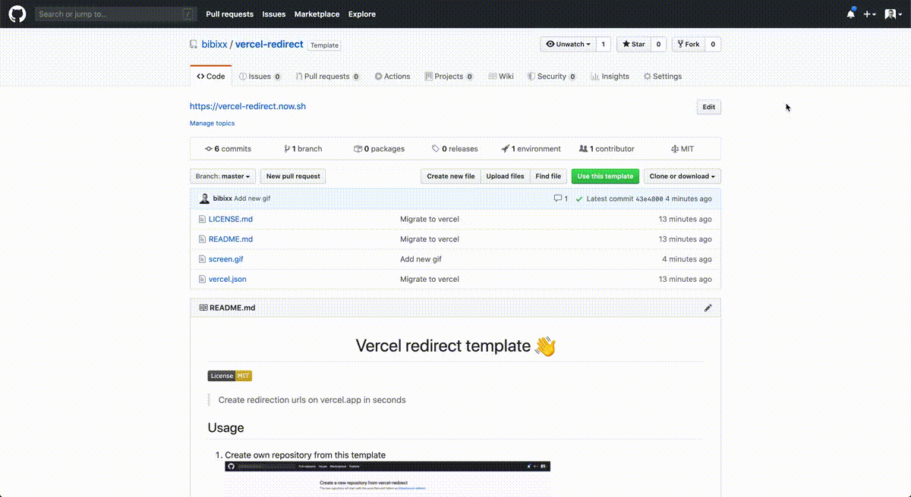

<h1 align="center">Vercel redirect template 👋</h1>
<p>
  <a href="https://github.com/bibixx/vercel-redirect/blob/master/LICENSE.md" target="_blank">
    
  </a>
</p>

> Create redirection urls on vercel.app in seconds

## Usage

1. Create own repository from this template


2. Adjust `vercel.json`
```js
{
  "alias": "vercel-redirect.vercel.app",
  //        ^ change this to the URL you want to redirect from
  "routes": [
    {
      "src": ".*",
      "status": 308,
      "headers": {
        "Location": "https://example.com"
        //           ^ change this to the URL you want to redirect to
      }
    }
  ]
}
```

3. Deploy to vercel using
```sh
vc
```

## Author

👤 **bibixx**

* Website: https://legiec.io
* Twitter: [@bibix1999](https://twitter.com/bibix1999)
* Github: [@bibixx](https://github.com/bibixx)

## 🤝 Contributing

Contributions, issues and feature requests are welcome!<br />Feel free to check [issues page](https://github.com/bibixx/vercel-redirect/issues).

## Show your support

Give a ⭐️ if this project helped you!

## 📝 License

Copyright © 2019-2020 [bibixx](https://github.com/bibixx).<br />
This project is [MIT](/LICENSE.md) licensed.

***
_This README was generated with ❤️ by [readme-md-generator](https://github.com/kefranabg/readme-md-generator)_
